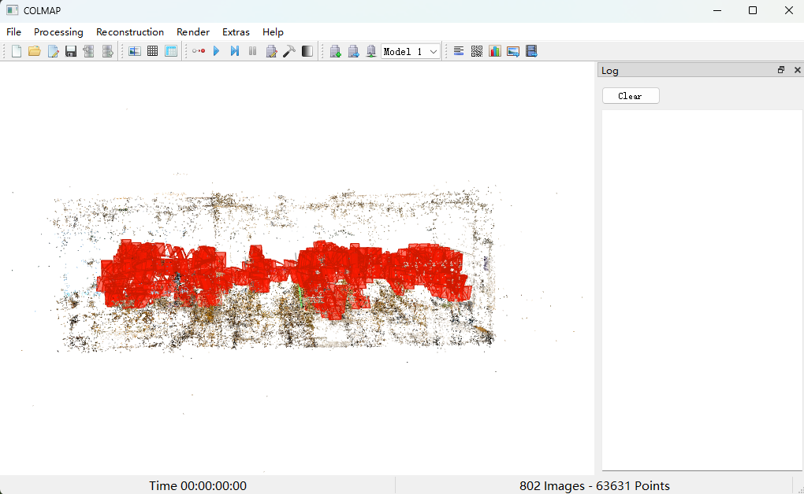
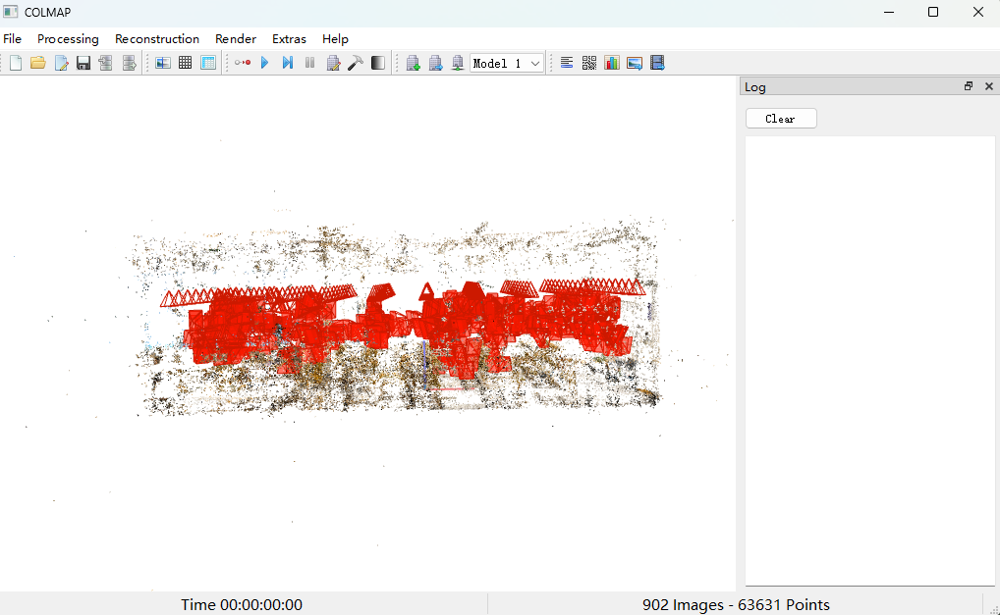

# 本项目是针对室内3DGS生成正射影像的教程和重要的一些代码

## 由colmap开源软件生成稀疏点云和相机位姿

数据输入格式参照3DGS格式，导出为.txt格式
<div align="center">
  
</div>

## 坐标系转化
代码位于[坐标系转化生成虚拟视角](./create_virtual_camera.py)，主要是利用ransack算法估计地面平面，将世界坐标系的z轴转化到地面平面上，方向朝上，然后通过XY 轴曼哈顿对齐 (Manhattan World Alignment)，房间一般都是矩形，已知z轴即可通过降维将点全部投影到xoy平面中然后通过最小包围盒算法找到x，y轴方向，xy轴方向需要与房间的墙面平行，所以该算法适合于矩形房间。
<div align="center">
  
</div>

## 准备3DGS训练数据
代码位于[生成占位图像](./create_dummy_images.py)，为了顺利进入3DGS训练，需要生成虚拟视角的占位图，这些图像不需要参与训练，只需要渲染即可。

## 训练3DGS
这部分与[3DGS](https://github.com/graphdeco-inria/gaussian-splatting)训练逻辑一致，但是加入的虚拟视角是不需要参与训练的，所以对[3DGS训练代码](./train.py)进行修改，这个demo主要是根据另外一个项目写的，这个项目同样适用，可以忽略添加的其他一些参数。只需要将这个train.py替换掉3DGS中的train.py即可。

## 渲染3DGS
由于3DGS训练与渲染采取的是透视投影，所以需要重新创建一个虚拟环境，这个新的虚拟环境中只做渲染不做训练，我们仅仅需要更改一下投影关系即可，具体来说更改下面的文件，我已经上传我更改后的文件，修改cuda后需要重新编译一下，或者在安装虚拟环境前更改文件，然后按照3DGS官方流程在装虚拟环境。
```python
utils/graphics_utils.py
gaussian_renderer/__init__.py
scene/cameras.py
submodules/diff-gaussian-rasterization/cuda_rasterizer/forward.cu
```

在修改[3DGS渲染代码](./render.py)使其只渲染虚拟视角，由于生成的图像相机内参是与真实图像一致的，所以所覆盖的视野我们是不确定的，所以需要更改```python create_virtual_camera.py```渲染n*n的图像来保证能够覆盖到所有的范围，n这个值一般设为10

## 修复图像

这里使用的是[DIFIX3D](https://github.com/nv-tlabs/Difix3D)官方修复，采用无参考视图的方法修复的，因为渲染的视角是从上往下的正射投影，而图像采集视角一般是人平视或者仰视拍摄，所以渲染出来的图像会有伪影，此时采取修复的方法来修复伪影，从而获得干净的视角。

<div align="center">
  
</div>

<div align="center">
  
</div>
