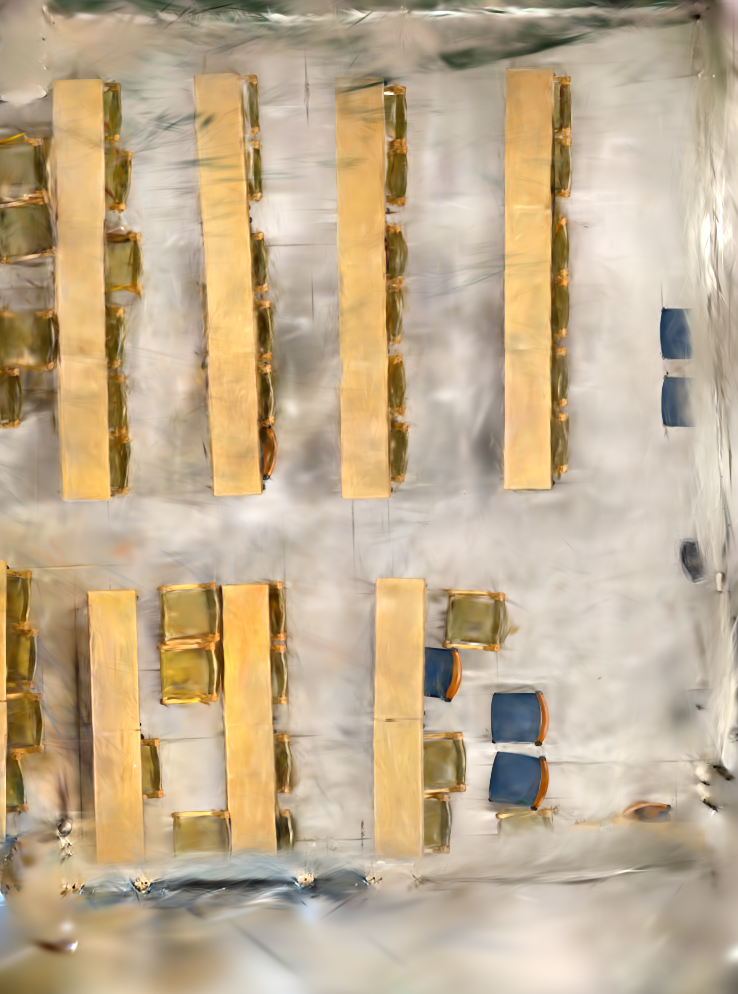
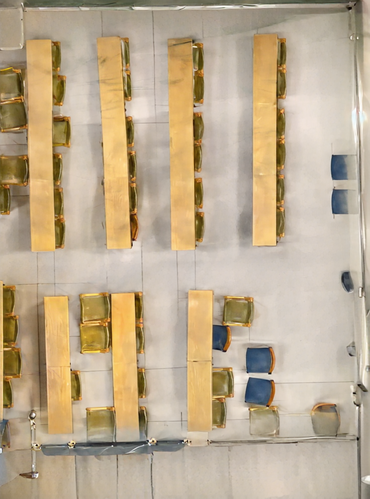
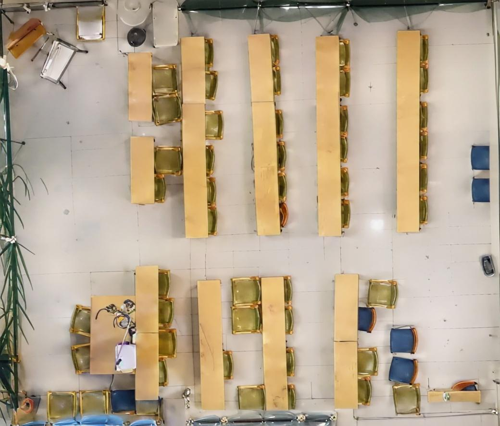

# 基于3D Gaussian Splatting的室内正射影像生成

本教程详细介绍了从多视角图像生成室内正射影像的完整流程，涵盖从稀疏重建、坐标系对齐、模型训练到最终图像拼接与修复的各个环节。

## 1. 稀疏点云与相机位姿生成

使用开源软件 COLMAP 从输入图像中恢复稀疏点云和相机位姿。  
数据需组织为3DGS标准输入格式，并导出为`.txt`文件。

  

## 2. 坐标系对齐

代码位于：[坐标系转换与虚拟相机生成](./create_virtual_camera.py)

- **地面估计**：通过RANSAC算法估计地面平面，将世界坐标系的Z轴对齐至地面法向（垂直向上）
- **曼哈顿对齐**：在矩形房间假设下，将点云投影至XOY平面，通过最小包围盒确定与墙面平行的X、Y轴方向

  

## 3. 准备3DGS训练数据

代码位于：[生成占位图像](./create_dummy_images.py)

为顺利进行3DGS训练，需生成一组虚拟相机视角的占位图像。这些图像不参与训练，仅用于后续渲染。

## 4. 训练3DGS模型

训练流程与原始[3D Gaussian Splatting](https://github.com/graphdeco-inria/gaussian-splatting)项目基本一致。  
本项目中，虚拟相机视角不参与训练，因此对训练代码进行了适配调整。

**使用方法**：将本项目提供的 [train.py](./train.py) 替换原3DGS代码中的对应文件即可。  
（注：本Demo基于其他项目修改而来，部分额外参数可忽略）

## 5. 渲染3DGS模型

由于3DGS默认使用透视投影，为生成正射影像，需在新虚拟环境中单独进行渲染，并修改投影关系。

**需修改的文件如下：**
- `utils/graphics_utils.py`
- `gaussian_renderer/__init__.py`
- `scene/cameras.py`
- `submodules/diff-gaussian-rasterization/cuda_rasterizer/forward.cu`

建议在安装环境前完成上述文件的修改，并按官方流程编译CUDA扩展。

**渲染执行**：通过修改后的 [render.py](./render.py) 仅渲染虚拟视角。  
由于虚拟相机内参与真实相机一致，视野覆盖范围不确定，建议在 `create_virtual_camera.py` 中设置网格状相机阵列（如5×5），以确保完整覆盖目标区域。

## 6. 图像修复

使用 [DIFIX3D](https://github.com/nv-tlabs/Difix3D) 进行无参考修复。  
由于渲染视角（垂直向下）与采集视角（平视/仰视）差异较大，渲染结果可能出现伪影，本步骤用于消除这些伪影，获得清晰图像。

  
  

## 7. 图像拼接

虚拟相机按网格排列，重叠度高且光照一致，适合采用特征匹配进行拼接。

- 使用Python `stitch_images` 库，基于SIFT特征匹配与单应性矩阵进行图像融合
- 拼接后边缘可能存在冗余区域，可手动裁剪
- （注：曾尝试通过角点检测与透视变换自动裁剪，但效果下降，故建议手动处理）

对裁剪后的图像可再次使用DIFIX3D进行修复，最终得到完整的室内正射影像。

  
  

